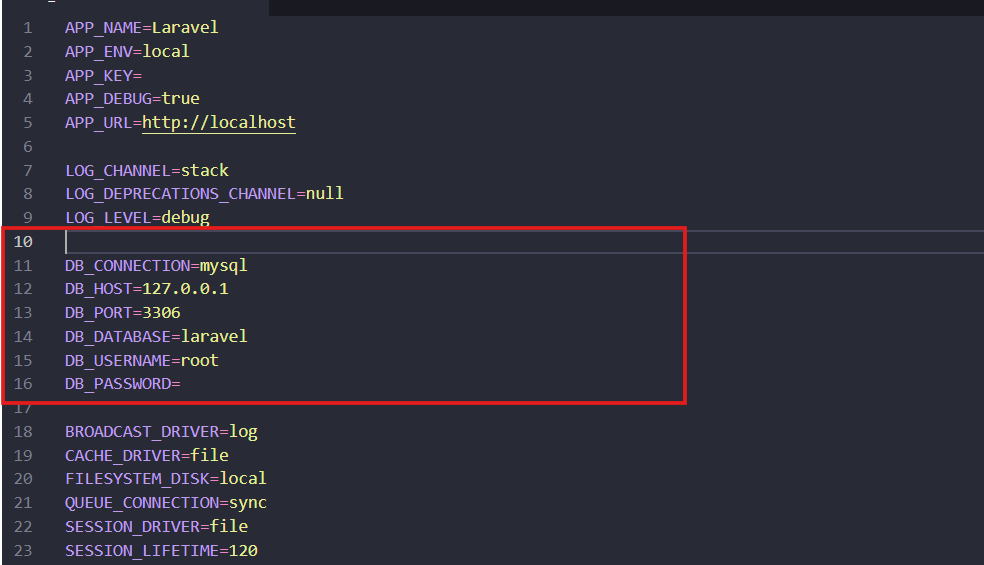
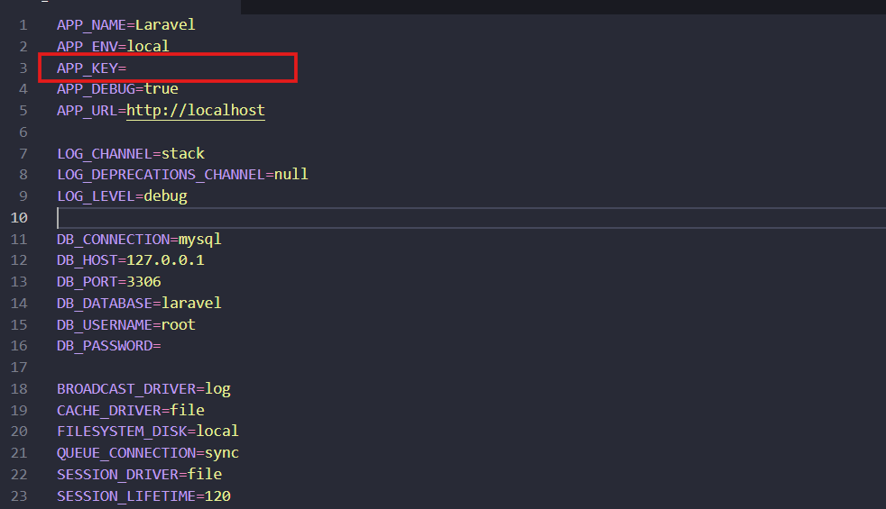

<p align="center"><a href="https://laravel.com" target="_blank"></a></p>

<p align="center">
<a href="https://github.com/laravel/framework/actions"></a>
<a href="https://packagist.org/packages/laravel/framework"></a>
<a href="https://packagist.org/packages/laravel/framework"></a>
<a href="https://packagist.org/packages/laravel/framework"></a>
</p>

## About Laravel

Laravel is a web application framework with expressive, elegant syntax. We believe development must be an enjoyable and creative experience to be truly fulfilling. Laravel takes the pain out of development by easing common tasks used in many web projects, such as:

- [Simple, fast routing engine](https://laravel.com/docs/routing).
- [Powerful dependency injection container](https://laravel.com/docs/container).
- Multiple back-ends for [session](https://laravel.com/docs/session) and [cache](https://laravel.com/docs/cache) storage.
- Expressive, intuitive [database ORM](https://laravel.com/docs/eloquent).
- Database agnostic [schema migrations](https://laravel.com/docs/migrations).
- [Robust background job processing](https://laravel.com/docs/queues).
- [Real-time event broadcasting](https://laravel.com/docs/broadcasting).

Laravel is accessible, powerful, and provides tools required for large, robust applications.

## Learning Laravel

Laravel has the most extensive and thorough [documentation](https://laravel.com/docs) and video tutorial library of all modern web application frameworks, making it a breeze to get started with the framework.

You may also try the [Laravel Bootcamp](https://bootcamp.laravel.com), where you will be guided through building a modern Laravel application from scratch.

If you don't feel like reading, [Laracasts](https://laracasts.com) can help. Laracasts contains over 2000 video tutorials on a range of topics including Laravel, modern PHP, unit testing, and JavaScript. Boost your skills by digging into our comprehensive video library.

## Laravel Sponsors

We would like to extend our thanks to the following sponsors for funding Laravel development. If you are interested in becoming a sponsor, please visit the Laravel [Patreon page](https://patreon.com/taylorotwell).

### Premium Partners

- **[Vehikl](https://vehikl.com/)**
- **[Tighten Co.](https://tighten.co)**
- **[Kirschbaum Development Group](https://kirschbaumdevelopment.com)**
- **[64 Robots](https://64robots.com)**
- **[Cubet Techno Labs](https://cubettech.com)**
- **[Cyber-Duck](https://cyber-duck.co.uk)**
- **[Many](https://www.many.co.uk)**
- **[Webdock, Fast VPS Hosting](https://www.webdock.io/en)**
- **[DevSquad](https://devsquad.com)**
- **[Curotec](https://www.curotec.com/services/technologies/laravel/)**
- **[OP.GG](https://op.gg)**
- **[WebReinvent](https://webreinvent.com/?utm_source=laravel&utm_medium=github&utm_campaign=patreon-sponsors)**
- **[Lendio](https://lendio.com)**

## Contributing

Thank you for considering contributing to the Laravel framework! The contribution guide can be found in the [Laravel documentation](https://laravel.com/docs/contributions).

## Code of Conduct

In order to ensure that the Laravel community is welcoming to all, please review and abide by the [Code of Conduct](https://laravel.com/docs/contributions#code-of-conduct).

## Security Vulnerabilities

If you discover a security vulnerability within Laravel, please send an e-mail to Taylor Otwell via [taylor@laravel.com](mailto:taylor@laravel.com). All security vulnerabilities will be promptly addressed.

## License

The Laravel framework is open-sourced software licensed under the [MIT license](https://opensource.org/licenses/MIT).


# Project AFAF

## Description

The project’s objective is to raise awareness amongst the users about the importance of checking news veracity before sharing or giving them credibility. Throughout two interactive activities, users will be able to learn how to identify false information and comprehend the relevance of contrasting sources.

## Contents

### 1. Quiz True or False

- **Description**: This quiz presents a series of news titles, where the user must decide if each one is true or false.
- **Structure**:
  - Each question is accompanied by an argument explaining the veracity of the selected title. 
  - The objective is to help users develop critical thinking abilities in order to evaluate the information they consume.

### 2. Interactive Video

- **Description**: This activity allows users to select between different videos related to the topic of verifying news.
- **Functionality**:
  - According to the users’ choice, an specific video will be shown illustrating the different aspects on how to verify news.
  - This visual representation aims to capture the user’s attention and offer them valuable information in a dynamic manner.

## Project Structure

The structure of directories and project files can be seen below:

```
fakeNews
├── app
│   └── Contains the applications’ source code, including controllers, models and │middleware. 
├── bootstrap
│   └── Boot-up files of the application, including the `app.php`file.
├── config
│   └── Configuration files of the application.
├── database
│   └── Contains the migrations and seeders of the database.
├── lang
│   └── en
│   	└── English translation files.
├── public
│   └── Public directory where accessible files can be found, such as `index.php` and │resource files.
├── resources
│   └──  Contains the views and resource files, such as CSS and JavaScript.
├── routes
│   └── Defines the routes of the application.
├── storage
│   └── Files generated by the application, such as logs and cache.
├── tests
│   └── Contains the automated tests for the application.
├── .editorconfig
├── .env.example
├── .gitattributes
├── .gitignore
├── README.md
├── artisan
├── composer.json
├── composer.lock
├── import.sql
├── package.json
├── phpunit.xml
└── vite.config.js
```

### Key Files

- **.env.example**: Configuration file of the environment that must be copied in `.env` and configured before executing the application.
- **composer.json**:  Configuration file of Composer that manages PHP’s dependencies.
- **package.json**: File that manages Javascript’s dependencies.
- **phpunit.xml**: Configuration to execute tests with PHPUnit.
- **vite.config.js**: Configuration for Vite, the package manager for the frontend side.

## Installation

1. **Clone the repository:**

   ```bash
   git clonehttps://github.com/afaf2024/fakeNews.git
   cd your-repository
   ```

2. **Install PHP’s dependencies:**

   ```bash
   composer install
   ```

3. **Install JavaScript’s dependencies:**

   ```bash
   npm install
   ```

4. **Configure `.env` file:**

   Copy the `.env.example` file to `.env` and edit the variables according to your environment.



```bash
php artisan key:generate
 ```


5. **Database and user creation**

```bash
create database name_yourdb default character set utf8 collate
utf8_unicode_ci;
 ```
```bash
create user nameuser@localhost identified with mysql_native_password by
'yourpassword';
 ```

```bash
grant all on name_yourDB.* to  nameuse@localhost;
 ```

6. **Execute the migrations:**

   ```bash
   php artisan migrate
   ```

7. **Follow the instructions to import a Database into phpMyAdmin:**
   
- **Access phpMyAdmin**
    To begin, open your browser and head to the URL of phpMyAdmin
    Generally, it should be similar to:
    
    ```
    http://localhost/phpmyadmin
    ```
- **Select a Database**
    Once you have accessed phpMyAdmin:
    - On the left panel, search and select the database where you wish to import the SQL file.
    - If you don’t have a database, you can create a new one by selecting the option “Databases” on the upper menu and entering a name for your new database.

- **Go to the Import Tab**
    After selecting the database, follow the next steps:
    - Click on the **Import** tab located on the upper part of the screen.

- **Upload the `import.sql` file**
    In the import section, do the following:
    - **File to Import**: Click on the **Choose file** (or **Browse**) button and select the `import.sql`file we provide you.
 
 - **Execute the Import**
    - Click on the **Continue** button to start the importation of the SQL file.
 
8. **Initiate the development server:**

   ```bash
   php artisan serve
   ```


